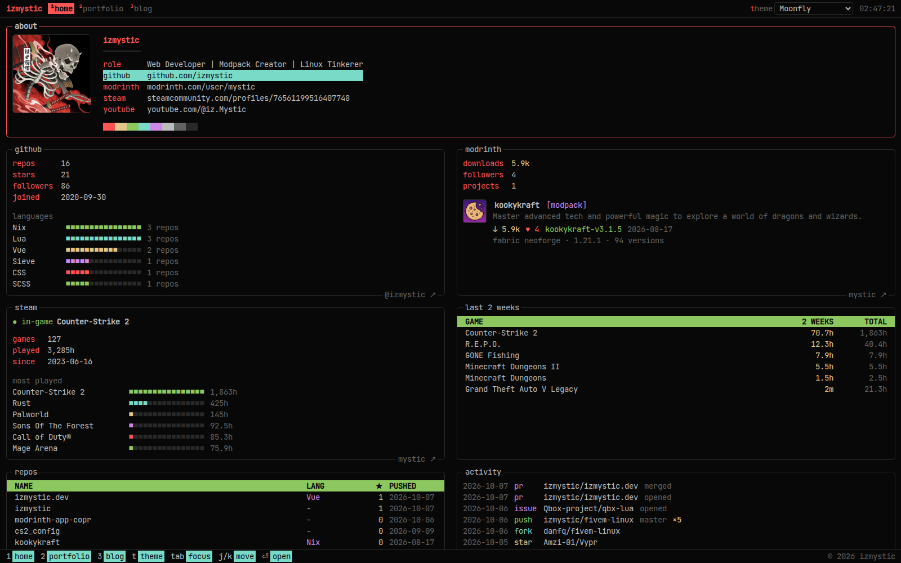

# izmystic.dev

My personal site, built to look and feel like a terminal app: btop-style panels, htop-style tables, keyboard navigation and 112 terminal color themes.



## Features

- **Live dashboard** with GitHub stats, languages, repos and activity, Modrinth projects, and Steam playtime plus what I'm playing right now
- **Portfolio and blog** written in Markdown and YAML with Nuxt Content
- **Keyboard driven**: `1` `2` `3` switch pages, `tab` moves between panels, `j`/`k` move, `⏎` opens, `t` picks a theme
- **Every theme from [terminalcolors.com](https://terminalcolors.com/)**, remembered per visitor and rendered on the server with no flash
- **Generated share cards** that match the site's default theme

## Stack

[Nuxt 4](https://nuxt.com) · [Nuxt Content](https://content.nuxt.com) · [Tailwind CSS 4](https://tailwindcss.com) · [nuxt-og-image](https://nuxtseo.com/og-image) · [Bun](https://bun.sh) · hosted on [Cloudflare Pages](https://pages.cloudflare.com)

## Development

```bash
bun install
bun run dev
```

Copy your keys into a `.env` file in the project root:

```bash
NUXT_STEAM_API_KEY=   # required for the Steam panels, from https://steamcommunity.com/dev/apikey
NUXT_GITHUB_TOKEN=    # optional, raises the GitHub API rate limit; needs no permissions
```

## Making it yours

| What | Where |
| --- | --- |
| Name, role, avatar and links | `content/index.yml` |
| Portfolio projects | `content/portfolio.yml` (screenshots go in `public/`) |
| Blog posts | `content/blog/*.md` |
| Default theme | `defaultTheme` in `app/app.config.ts`, any id from `app/utils/themes.ts` |
| GitHub, Modrinth and Steam accounts | `runtimeConfig` in `nuxt.config.ts` |

## Deploying to Cloudflare Pages

- **Build command:** `bun install --frozen-lockfile && bun run build`
- **Build output directory:** `dist`
- **Variables:** `SKIP_DEPENDENCY_INSTALL=1`, `BUN_VERSION=1.4.2`, plus the keys above as secrets. `NUXT_OG_IMAGE_SECRET` is optional.
- **Bindings:** a D1 database bound as `DB`, which Nuxt Content fills on first request
- **Runtime:** compatibility flag `nodejs_compat`

## License

[AGPL-3.0](LICENSE)
